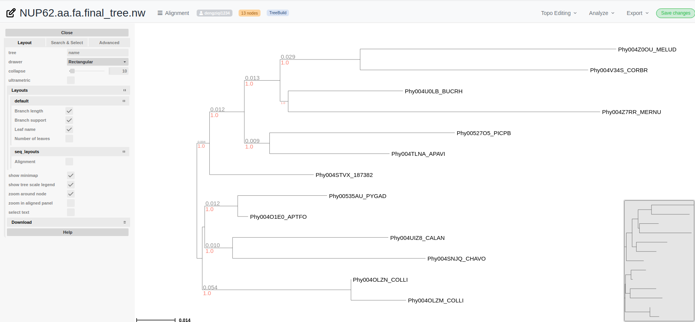
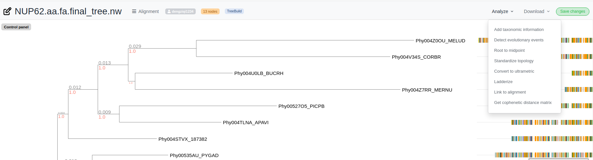

# Overview
Welcome! [PhyloCloud](https://phylocloud.cgmlab.org/) is an easy-to-use online platform for operating and interpreting phylogenetic trees and multiple sequence alignments, serving as a bridge between complex phylogenomic frameworks and non-expert users. Users can browse the public tree collections or build and save your own trees at your own workplace both registerially and anonymously. https://phylocloud.cgmlab.org/

# Quick Start
 PhyloCloud provides entry point to annotated data and tools for phylogenomic research, regardless of whether registered or anonymous users. The home page of PhyloCloud indicates the most typical features so you can quickly start using PhyloCloud:

 - [Upload and visualize trees](#uploadtree) , registerially or anonymously
 - [Build your phylogenies](#buildtree)  by just one click
 - [Browse and search](#browsetree) public tree collection

Besides of common usage for trees management, we also provide various phylogenetic tools to conduct various analysis

 - [Compare tree topologies](#comparetree)
 - [Query taxonomy databases](#taxaquery) 
 - [Sequence placement](#sequenceplacement)


If you already have a tree, PhyloCloud implemented the state-of-art tree visualizing engine and provide various options for further modification or analysis.

- [Tree visualization](#treepage) with different tree edition, anaylsis and annotation
- [Tree Annotation](#treeannotation) annotate trees with taxonomic, evolutionary events

# UploadTree
One of the core features in PhyloCloud is to allow user upload multiple trees as a collection. Click the [Upload tree](https://phylocloud.cgmlab.org/) button at the top right corner of the page to open the upload panel.


Input trees are expected to be in plain text files which not bigger than 50MB(~500,000 tips), and at the moment we support Newick format and parse with ETE Toolkit, for further imformation about newick format, please check [ETE Toolkit](http://etetoolkit.org/docs/latest/tutorial/tutorial_trees.html#reading-newick-trees)

Phylocloud also allows user to attach alignment (<500MB) with corresponding tree. If you upload alignment files alongside with treefiles, please note that they must share the same prefix, otherwise alignments are not able to detect as attachment.

Besides of data input, users can also choose if their collection private or public for other users. Collection name is optional, once a collection is created, it will generate a collection id and it will be the collection title if it was not named. Anonymous user will be directed to the collection page where storage the trees you just upload. For registered users, they will be redirected to [my cloud](https://phylocloud.cgmlab.org/my_cloud/) where your private cloud is. 

``` *Noted Anonymous users should remember the collection id otherwise it will be lost. ```

# BrowseTree
In phylocloud we have storage a several of featured collections which is public and open for browsing and download. Click [Featured Collection](https://phylocloud.cgmlab.org/public_cloud/) to enter the public collection portal. Once your interested collection, click the collection title and entered the collection page.

Here we show example of [eggNOG5](https://phylocloud.cgmlab.org/collection_page/61c3074a7b69b966754c2c4e/) collection:


- Trees of collection are displayed as tree cards with thumnails, with treecard you can find basic information of each tree, such as owner, title, and download button of tree and alignment(if there is)
- User can search trees by <strong>tree title</strong> or <strong>node</strong>'s name against public collection or own collection. When users are at collection page, the search filter will switch to Current Collection where allows user to search within collection

# Phylogenomic tools
# BuildTree
Phylocloud provides a automated phylogenetic workflows to construct phylogeneies with a simple click. Submit nucleotide or amino acids sequences in FASTA format and infer a phylogeny using ETE-Toolkit predefined workflows.  Click [here](https://phylocloud.cgmlab.org/tree_build/) to explore more

Once the job has submit, it will be redirect to result page with job id. After a waiting patiently for a moment, result tree will be render and visualized on the result page. 

``` *Noted users should remember the job id otherwise it will be lost. ```

# CompareTree
Phylocloud allows users to compute topological distances between trees and compare differences side-by-side.

Comparison result will be shown below, it consists of two part:


the first part is the topological comparisons, 
- once you hover to the target node, it shows the features of the node and the corresponding note in the comparing target will be highlighted.
- mismatches can be tracked up to internal nodes which are highlighted as red dot


the second part is a statistic summary which contains the information of 
statistic difference. The reported values are:

- rf, Robinson-Foulds symmetric distance
- max_rf, maximum Robinson-Foulds value for this comparison
- norm_rf, Normalized Robinson-Foulds distance (RF/maxRF)
- eucl dist, Euclidean distance between two trees
- mismatches, number of mismatches that compare
- %src_br frequency of edges in target tree found in the reference (1.00 = 100% of branches are found)
- %ref_br frequency of edges in the reference tree found in target (1.00 = 100% of branches are found)
- effective_tree_size, Effective tree size used for comparisons (after pruning not shared items)
- treekoD Average distance among all possible subtrees in the original target trees to the reference tree
- subtrees Number of subtrees used for the comparison (applies only when duplicated items are use to decomposed target trees)

# TaxaQuery
Phylocloud allows to download, parse and query a local copy of the NCBI/GTDB taxonomy database.

Query by Ids:


Taxa tree result will be shown below


# TreePage
Once upload your tree, you are able to visualize it on the TreePage


if you want to perform any tree editing, such as node labeling, layouts editing, click the  <strong>Control Panel</string> on top left corner or right click to target node



# TreeAnnotation

if you want to perform any analysis or annotations, such as taxonomic or evolutionary detection, click the <strong>Analyze</string> from the navigator



Currently we provide four options of analysis:

## 1) Taxonomic annotation
This action will extract taxa information from the tree leaves and annotated the tree accordingly.

By default, NCBI/GTDB TaxIDs will be extracted from the leaf names by splitting by the dot symbol (e.g, delimiter='.'), and taking the first element of the string (index=0), and choose NCBI or GTDB for Taxa DB.

NCBI annotation example https://phylocloud.cgmlab.org/tree_page/61c3061f33448902b5c2882b/

GTDB annotation example https://phylocloud.cgmlab.org/tree_page/6234703aa614694328db1570/


After select correctly column info, click Annotate


Taxa info will be activated in tree layouts at aligned panel


## 2) Evolutionary annotation
This action will scan tree topology and use species information of each leaf to infer speciation and duplication events.

By deafult, species names are extracted by splitting leaf names by the dot symbol (delimiter='.'), and taking the first element (index=0)

Check example https://phylocloud.cgmlab.org/tree_page/62458ebb0d85d1b583543600/


In this example case, delimiter is "_", so we need to replace "." with `_` . 


After annotation, Speciation events are lable as blue dots, and Duplication is red dots at the last comman ancestors 