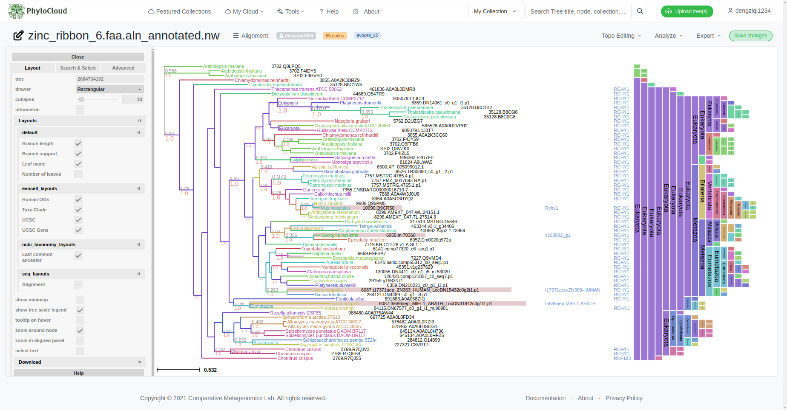
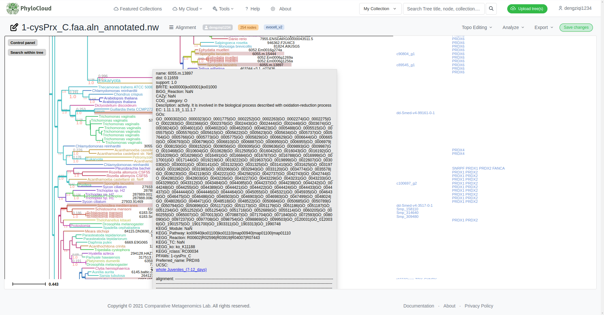
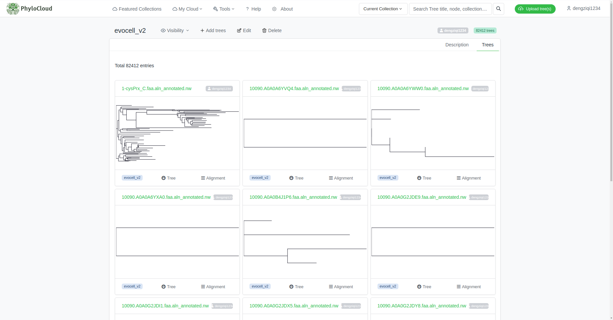
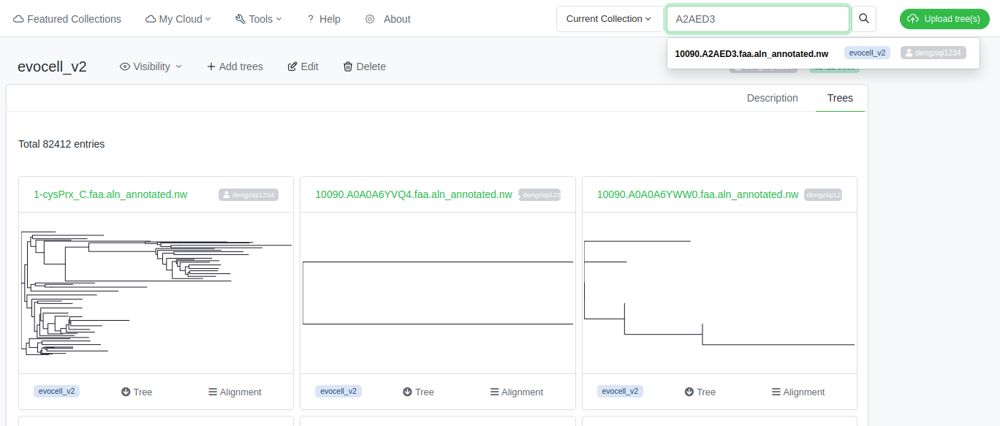
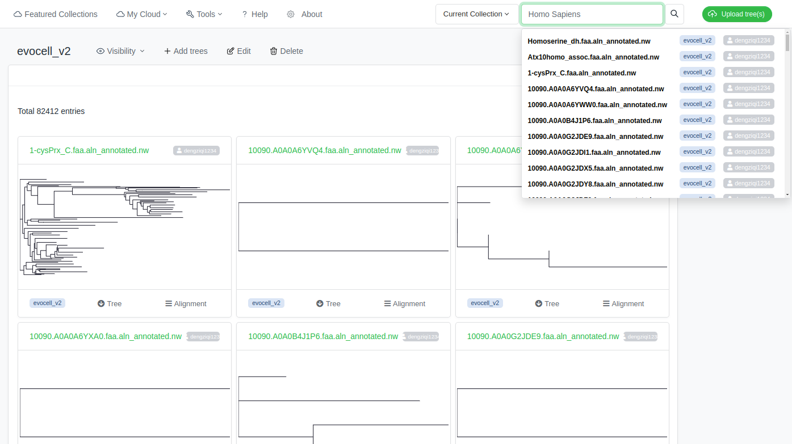
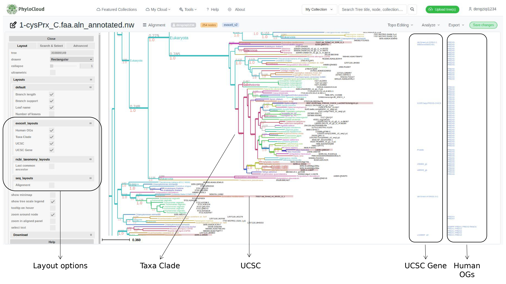
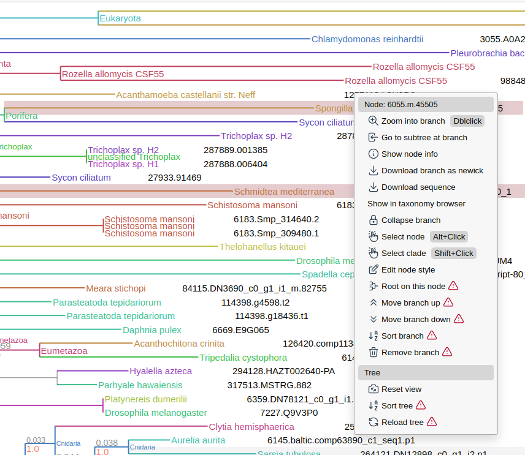
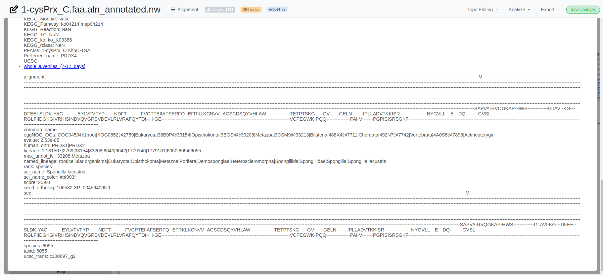

# Overview of evocell_v2 collection
EvoCELL Database (https://apps.embl.de/evocelldb) is a resource focused on single-cell data, especially from non-model species. Initiated in 2018, this project spanned 3.5 years, with a primary focus on understanding the evolution of cell types and tissues across a diverse range of vertebrates and invertebrates.

The core of EvoCELL revolves around single-cell data, with datasets spanning massive non-model metazoans, from the Clytia hemisphaerica to the Platynereis dumerilii. The research within the network is multifaceted, encompassing areas like regeneration, nervous system development, and more. Each research line, with its unique model species, has contributed its datasets, leading to a concerted effort to integrate this data for evolutionary insights. Notably, the datasets are not just
confined to adult organism cells but also encompass embryos and specific tissues. A significant portion of this single-cell data has been made accessible to the scientific community via the UCSC Cell Browser (https://cells.ucsc.edu/)

We utilized 82,433 phylogenetic trees from EvoCELL Database. These trees underwent functional and taxonomic annotation using eggNOG mapper. Subsequently, TreeProfiler was employed to annotate this vast array of trees, culminating in a comprehensive annotated dataset (see Figure 1). To make this data accessible and interactive for users worldwide, we hosted it on PhyloCloud (https://phylocloud.cgmlab.org/collection_page/6458f05f8cc8cfa2043d95d1/), ensuring that the insights and resources of these trees are just a click away (see Figure 2).

Figure 1: Global view of example tree from EvoCELL dataset in PhyloCloud. Highlighted node in red is associated with the single cell data portal in UCSC Cell Browser.

Figure 2: Example tree from EvoCELL dataset in PhyloCloud. Highlighted node in red contain
hyperlink associated with the single cell data portal in UCSC Cell Browser.

# Evocell Collection Page
At this moment, evocell collection is stored in the https://phylocloud.cgmlab.org/collection_page/6458f05f8cc8cfa2043d95d1/ which is not open for the public yet unlike Featured Collections in PhyloCloud

Overview of evocell collection page (https://phylocloud.cgmlab.org/collection_page/6458f05f8cc8cfa2043d95d1/)

## How to query
Use the input box from the top right to type words searching for trees. Those words will be searched among the tree name, leaves, uniprot entries (such as *A0A0A6YVQ4*) which is included in the name 

or species data (such as *Homo Sapiens*)

# Evocell Tree Page
Once open on some certain tree in the dataset, each tree contains several of layouts designed for visualized the annotations of the target tree. 

Although the annotations of each tree contains more information! Such information are stored in each node, users can click on each node to check the annotations. For example, each sequence which contains UCSC information has a portal to corresponding UCSC Cell Browser. 

Click on "Show node info" for more annotation in tree node

Each annotation is shown as dictionary, especially UCSC annotation, which is a hyperlink to corresponding UCSC Cell Browser

